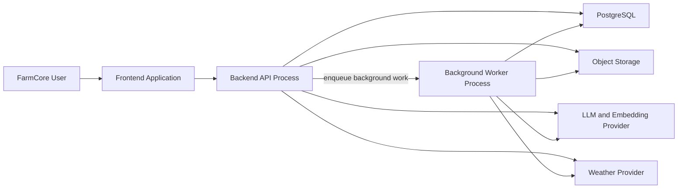

# FarmCore System Shape

Sources:

- [POC Golden Path](poc-golden-path.md)
- [Architecture Decision Checklist](architecture-decision-checklist.md)
- [Project Brief](../client-notion/project-brief.md)

FarmCore POC uses a modular monolith. Modules are separately owned and tested in one backend codebase, not independently deployed microservices.

## Confirmed Shape

```text
One frontend application
One backend/API codebase
One PostgreSQL database with pgvector and PostGIS
One object store
Background worker processes from same backend codebase
```

## Runtime Boundaries



Frontend only calls the Django backend. It does not access PostgreSQL, object storage, LLM provider, or weather provider directly.

PostgreSQL with the `pgvector` extension stores document embeddings for the POC.
Embeddings remain a retrieval index, rather than a source of truth for operational
facts. The team may later compare this choice with **Qdrant** using concrete
criteria: retrieval quality, filtering by farm/permissions, operational setup,
cost, and deployment fit. No separate vector database is introduced initially.

PostGIS provides farm/place geography. The current SQL DDL still needs its
geometry/geography migration. Farm coordinates are the weather input, while
place boundaries support the planned map view. Seeded POC places use
`MULTIPOLYGON` boundaries; a map can derive a display anchor inside each place.
This represents assigned/scheduled task state at a place, not live GPS tracking.
Operational Demo Farm boundaries are seeded. A real farm may begin with only the
required weather point; boundary entry is optional and an in-app polygon editor
is deferred.

## API Boundary

The Django backend owns two related HTTP interfaces:

- **Django pages and HTMX fragment endpoints** return server-rendered HTML for
  browser interactions. For example, approving a schedule can return a refreshed
  schedule-table fragment.
- **REST JSON endpoints under `/api/`** expose controlled operations for
  assistant tools, integrations, and future non-browser clients. HTMX may use
  them selectively, but it does not need client-side JSON rendering for normal
  page updates.

The REST API will have an **OpenAPI specification**: a machine-readable contract
describing each endpoint's path and HTTP method, authentication, request fields,
response fields, and error responses. It supports generated documentation,
tests, and later client integrations. The team will define the first endpoint
contracts before generating the detailed specification.

The POC REST API is rooted at `/api/` with no URL version prefix. The OpenAPI
document carries its release version instead. Long-running operations return an
accepted/status reference immediately; background workers update durable
PostgreSQL status that HTMX pages or JSON clients can poll.

For the POC, the technology split is:

```text
Django                  Backend framework, ORM, authentication, pages and workers
HTMX                    Browser interaction through server-rendered HTML fragments
Django REST Framework   REST JSON endpoints under /api/
drf-spectacular         Generated OpenAPI schema and interactive API documentation
```

FastAPI is not part of this architecture. It is an alternative API-oriented web
framework, and adding it beside Django would create an unnecessary second
application boundary for the POC.

The browser layer uses Django templates and HTMX only; no separate frontend
framework or frontend deployment is part of the POC. The UI team owns templates,
static assets, HTMX interactions, and map rendering. Django owns rendering,
authorisation, and all data access.

DRF serializers are the sole JSON contract definition. `drf-spectacular` derives
OpenAPI and Swagger UI from those serializers; the POC does not maintain a
separate shared-types package or duplicate API shape definitions.

## Authentication and Local Development

FarmCore uses Django session authentication with a custom email-based user model.
Farm-specific authorisation is enforced through the existing `farm_roles` model;
the selected farm must be checked on every data, document, assistant, and
scheduling operation. JWTs and external identity providers are deferred.

Every developer runs the same Docker Compose stack locally:

```text
Django application
PostgreSQL with pgvector and PostGIS
Redis
Django-RQ worker and scheduler
S3-compatible local object storage
```

The final demonstration hosting provider is intentionally undecided until the
local stack is stable.

### Local Document Storage

MinIO is the local S3-compatible object store. Its container exposes an API; it
is not a folder the application reads directly. The normal upload flow is:

```text
Browser upload -> Django document endpoint -> MinIO bucket -> Docker named volume
                                  |
                                  -> PostgreSQL document metadata and processing status
```

The named Docker volume persists uploaded objects when the MinIO container is
restarted or rebuilt. It is managed by Docker on the developer's machine and is
not committed to the repository. For repeatable demos, seed documents may live
in the repository and a seed command uploads them to MinIO. Automated tests use
temporary test storage rather than a developer's personal document folder.

PostgreSQL stores metadata such as the farm, original filename, object key,
content type, file hash, upload status, and timestamps. It does not store the
original PDF/text-file bytes.

### Repeatable Demonstration Data

Development uses two distinct seeded farm states:

```text
Operational Demo Farm   Fully approved farm facts, documents, embeddings,
                        tasks, rules, and schedule. It supports immediate
                        chat, citation, and FarmFlow demonstrations.

Onboarding Demo Farm    Minimal farm and owner with no operational documents.
                        It demonstrates the real upload -> extraction ->
                        candidate review -> approval workflow.
```

Curated small PDF/text fixtures make onboarding processing predictable. The
onboarding demo must use the real browser, Django, RQ, MinIO, and candidate
approval path rather than a mocked result. Repeatable `demo-seed` and
`demo-reset` commands create both states and reset only onboarding-demo data.
This demo-only data never changes how a real new farm is onboarded.

### POC Roles

FarmCore starts with two farm-scoped roles:

```text
Farm owner   Full onboarding and farm access; user/role management; document,
             task/rule, and schedule approval actions.
Worker       Views own assigned tasks and approved schedule; updates task
             progress/completion and permitted working-hours availability.
```

The existing `roles` and `farm_roles` tables support this model. Manager and
viewer roles are deferred until the POC needs demonstrate them.

## Backend Modules

```text
auth and farm access
farm context and operational records
documents and extraction candidates
document retrieval
assistant orchestration and tools
tasks, templates, and rules
FarmFlow scheduling
weather integration
alerts and audit
```

Each module owns its application logic. Modules use shared domain types and database access layer within same codebase.

## Django Application Boundaries

The modular monolith is implemented as domain-focused Django apps, not as one
large application containing every model, view, and service. These apps remain
in one repository, use one PostgreSQL database, and deploy together.

```text
accounts     Users, roles, farm membership, and permissions
farms        Farm context, places, animal groups, crops, machinery, and records
documents    Uploads, document status, extraction candidates, and retrieval work
assistant    Chat orchestration, controlled tools, citations, and AI audit events
scheduling   Rules, templates, tasks, schedules, scheduled jobs, and FarmFlow
```

This division matches the major FarmCore domains and expected team ownership. It
reduces merge conflicts, keeps document extraction separate from scheduling
logic, and permits focused tests such as running FarmFlow tests without PDF
processing. It is not a microservice design: Django apps may use agreed public
service functions and shared models within the same backend.

Apps must avoid circular imports and broad catch-all utility modules. A domain
app owns its models and business logic; other apps call its deliberate service
interfaces rather than duplicating its rules.

Internal Django apps call those service functions in-process. They do not make
HTTP calls to each other's private endpoints or write another app's tables
directly. HTTP is the browser/integration boundary, not an internal monolith
boundary.

### Team Integration Rule

Teams can prototype their component independently. Integrated code must conform
to the agreed database schema, migrations, seed data, and documented input/output
contracts. A shared database is not permission for unrelated modules to write
each other's tables or duplicate business rules.

Each team owns its Django app and its small provider-client modules. For example,
the assistant team may experiment with multiple LLMs, but the merged application
uses only the concrete functions it needs in `assistant/llm_provider.py`, such as
`generate_chat_response()` and `generate_embeddings()`. No generic provider
framework or premature plug-in architecture is required.

The scheduler consumes approved PostgreSQL data and normalised weather data; it
does not call an LLM provider directly.

The assistant keeps context for the active conversation only. It is not required
to restore conversations after the session ends; durable chat history remains an
assistant-team implementation choice. Assistant responses that use FarmCore data
must show document or record citations, while general guidance is labelled as
such. A current-weather request is a controlled backend tool call that uses the
weather client and updates/reads the normal cache path; the model never receives
external API credentials.

When information needed for an answer is missing or conflicts, the assistant
must say so and seek clarification rather than silently deciding. Safety or
compliance guidance includes a visible warning and requests human verification
before action.

All important changes use the same review pattern: show the proposed change,
source/reason, and affected records; allow edit, confirmation, or rejection;
then write the result and an audit event. Audit records cover document processing,
assistant tool use/sources, candidate decisions, task changes, worker progress,
and schedule decisions as concise structured metadata rather than raw chat or
document content.

Document retrieval is authorised in the backend before vector similarity results
are returned. One pgvector index is sufficient: owner queries are limited to the
selected farm's active documents; worker queries are limited to farm-shared
safety/procedure documents and documents linked to that worker's assigned tasks.
The model never receives unfiltered retrieval access.

## Background Jobs

Background jobs handle slow or external work:

```text
document extraction and PDF parsing
embedding/vector indexing
candidate extraction
live weather retrieval
FarmFlow rebuild proposals
alert evaluation
```

API requests create jobs and return status. Worker processes run jobs and update PostgreSQL state. Users see status through normal backend APIs.

### POC Queue Choice

FarmCore uses **Django-RQ with Redis** for background work. A single RQ worker
handles the initial POC workload, and the RQ scheduler starts recurring work
such as weather refreshes and alert evaluation.

This is deliberately simpler than Celery: FarmCore needs independent background
jobs, not high-volume distributed processing or complex task workflows. Redis
transports queued work only. PostgreSQL remains the durable record of document
processing state, generated schedule proposals, and other business outcomes.

Every job must be idempotent. Retrying a job must update its existing result or
leave it unchanged; it must never create duplicate candidates, schedules, or
alerts.

## Why This Fits POC

```text
Shared types reduce integration mismatch.
One deployment path reduces operational overhead.
Modules still match team ownership boundaries.
Workers avoid blocking user requests.
Later system can split modules into services if evidence requires it.
```

## Open Decisions

2. First REST endpoint contracts and OpenAPI generation approach.
3. External integration boundaries: weather, LLM, embeddings, extraction/OCR.
4. Deployment platform and environment layout.
5. Observability, error reporting, and health-check approach.

## Environments

The POC starts with two environments only:

```text
Local development   One Docker Compose stack per developer
Shared demo         One hosted integration/presentation environment
```

A separate staging environment is deferred unless the shared demo becomes too
unstable for safe integration and presentation work.

## Operational Visibility and Retention

Swagger UI provides interactive API documentation/testing. `GET /healthz` checks
the Django service and required local dependencies: PostgreSQL, Redis, and MinIO.
Structured request and RQ-worker logs include correlation/job references but
redact raw documents, prompts, and secrets. No external monitoring platform is
part of the POC.

Archived documents and their derived chunks/embeddings/candidates remain retained
for the full POC lifetime but are immediately excluded from retrieval and new
extraction. Schedules and audit events are also retained. There is no automatic
purge job or permanent-deletion UI; `demo-reset` clears only controlled demo data.
