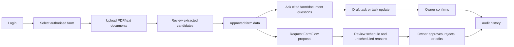

# FarmCore Team Meeting Brief


## Meeting Goal

Align us on one shared system before implementation begins:

```text
One farm-aware operational application
-> documents become searchable knowledge and approved farm facts
-> assistant answers from authorised sources and proposes actions
-> FarmFlow creates explainable weekly schedule proposals
-> humans review important changes
-> every significant action is traceable
```

The POC is intentionally constrained. We are proving the end-to-end workflow,
not building a production farm-management suite.

## The Product We Are Building

FarmCore has three connected capabilities:

1. **Farm operational data:** farms, places/paddocks, animal groups, crops,
   machinery, staff, tasks, rules, documents, weather, schedules, alerts, and
   audit events.
2. **AI assistant:** answers selected-farm questions from approved records and
   authorised documents, cites its sources, identifies missing/conflicting data,
   and creates reviewable drafts.
3. **FarmFlow:** creates one-week, weather-aware schedule proposals from approved
   tasks, rules, staff availability, machinery, places, and constraints.

Client sources: [Project Brief](../client-notion/project-brief.md) and
[User Stories](../client-notion/user-stories.md).

## POC Golden Path



Full record: [POC Golden Path](poc-golden-path.md).

## Architecture in One Minute

```text
Django + HTMX              Browser pages and interactive fragments
Django REST Framework      JSON API under /api/ and OpenAPI/Swagger UI
PostgreSQL + pgvector      Approved operational data and document embeddings
PostGIS                    Farm weather point and place boundaries for map context
MinIO                      Original document storage in local development
Redis + Django-RQ          Background work and periodic jobs
One modular monolith       One codebase, database, deployment, and worker setup
```

The frontend calls only Django. It never directly accesses the database, MinIO,
pgvector, LLM provider, or weather provider.

Full record: [System Shape](system-shape.md).

## Why a Modular Monolith

We are not building microservices. The project is one Django application split
into domain-owned apps:

```text
accounts     login, membership, permissions
farms        places, crops, animal groups, machinery, staff, records
documents    uploads, parsing, chunks, candidate review, retrieval
assistant    chat orchestration, controlled tools, citations, drafts
scheduling   rules, tasks, FarmFlow, schedules, alerts
```

Teams can work independently inside these boundaries. Shared schema, migrations,
seed data, and API contracts are the integration points. Internal apps call
deliberate Python service functions, not internal HTTP endpoints or each other's
tables directly.

## Data and Document Pipeline

Original files live in MinIO. PostgreSQL stores document metadata and approved
farm facts. pgvector indexes document chunks for retrieval; it is not the source
of truth for operational decisions.

```text
PDF/text upload
-> MinIO object + PostgreSQL document record
-> RQ parsing/indexing job
-> document chunks + retrieval index
-> extraction candidates
-> owner review: create / update / conflict
-> approved operational records
```

Every supported document is indexed for retrieval, even if it produces no
structured candidate. The owner does not need to populate every database table:
they establish farm/place/people/scenario context, upload documents, and confirm
the facts/rules that matter.

Full record: [Farm Owner Data Intake](farm-owner-data-intake.md).

## Security and Roles

The selected farm is stored in server-side session state. Every request and every
retrieval query checks active membership and farm scope.

```text
Owner   Full onboarding/configuration, document/candidate/rule/task approval,
        FarmFlow generation and schedule approval, audit access.

Worker  Own assigned work and map context, availability/progress updates,
        permitted supporting documents, incident upload/task-request submission.
```

Worker-reported maintenance work remains pending owner approval before it becomes
eligible for FarmFlow. The exact worker permission matrix and task-request schema
remain team-review questions.

Document retrieval uses one shared pgvector index but filters documents in the
backend before chunks reach the UI or LLM. Owners see active selected-farm
documents; workers see task-linked plus farm-shared safety/procedure documents.

## AI Assistant Boundaries

The assistant is useful but does not receive database credentials or direct SQL.
It uses controlled backend tools only.

```text
Read: farm context, tasks, approved rules, schedules, alerts,
      authorised document chunks, cached/current weather

Propose: task draft, task-update draft, FarmFlow proposal request

Never: directly activate records, approve rules/schedules, write SQL,
       or access unfiltered documents/weather APIs
```

Answers include citations, distinguish confirmed facts from general guidance,
surface missing/conflicting information, and warn on safety/compliance guidance.
Conversation continuity is required only for the current session; durable chat
history is optional and delegated to the assistant team.

## FarmFlow: What It Does and Does Not Do

FarmFlow does not invent farm strategy from free-text documents. Approved rules
and templates create known task occurrences; FarmFlow places those tasks.

```text
approved rules/templates -> tasks -> valid time/resource slots -> proposal
```

It is deterministic: the same approved inputs lead to the same proposal. LLM/RAG
may help extract candidate rules or explain results, but never chooses final task
placements.

Hard constraints remove invalid options, such as unavailable staff, unavailable
machinery, unfinished dependencies, invalid timing, or blocking weather. Soft
priorities choose among feasible slots, such as priority, due date, weather fit,
and preserving existing placement.

Owner edits a proposal freely. Placement edits validate conflicts immediately;
changing task definition/lifecycle triggers proposal revalidation or rebuild.
Approved schedules are never overwritten: FarmFlow creates a linked new proposal
and preserves completed work.

Full records: [FarmFlow Scheduler Explainer](../client-notion/farmflow-scheduler-explainer.md),
[FarmFlow Rescheduling](farmflow-rescheduling.md), and
[Scheduling Team Questions](scheduling-questions.md).

## Weather, Map, and Visualisation

The weather worker obtains a seven-day forecast every six hours from a free
provider, normalises it, and stores snapshots in PostgreSQL. FarmFlow uses the
latest snapshot and marks data stale after twelve hours.

PostGIS stores a required farm weather point and map boundaries for seeded POC
places. The map shows place boundaries and scheduled/current task state. It does
not claim live GPS tracking: an avatar represents work associated with a place.

Full record: [Weather Integration](weather-integration.md).

## API and UI Direction

Browser workflows use Django pages and HTMX fragments. `/api/` is a JSON API for
assistant tools, map state, integration, and testing. DRF serializers define the
JSON contract; `drf-spectacular` generates OpenAPI and Swagger UI from them.

```text
POST /api/farms/{farm_id}/select    sets authorised active farm
GET  /api/farm-context              returns dashboard snapshot
POST /api/documents                 queues upload processing
GET  /api/extraction-candidates     owner review queue
POST /api/assistant/messages        structured cited response/draft
POST /api/schedule-proposals         queues FarmFlow proposal
GET  /api/map-state                 GeoJSON boundaries + permitted task state
```

Use default Django REST Framework errors and HTTP statuses. Long-running actions
return accepted/status references rather than holding the browser request open.

Full record: [API Contract Questions](api-contract-questions.md).

## Development and Demonstration

Every developer runs the same Docker Compose stack:

```text
Django | PostgreSQL with pgvector/PostGIS | Redis | Django-RQ | MinIO
```

There are two demo farms:

```text
Operational Demo Farm   Ready data/documents/tasks/rules/schedule for immediate demo
Onboarding Demo Farm    Empty operational context for real upload/extraction/review demo
```

`demo-seed` creates both. `demo-reset` resets onboarding-demo data only. We use
local development plus one hosted shared demo environment. Swagger UI, `/healthz`,
and structured request/worker logs are sufficient operational visibility for the
POC.

Full record: [Skeleton Readiness Checklist](skeleton-readiness-checklist.md).

## Team Input Needed Today

Ask for recommendations, not immediate implementation:

1. **Scheduling team:** answer [Scheduling Team Questions](scheduling-questions.md),
   especially hard constraints, scoring, weather thresholds, and demo scenarios.
2. **Document/assistant team:** confirm first extraction candidate types and
   payload shapes; propose the document parsing, embedding, and LLM approach.
3. **All team:** review the proposed worker capabilities and maintenance-request
   workflow in the [Architecture Decision Checklist](architecture-decision-checklist.md).
4. **API/UI team:** use [API Contract Questions](api-contract-questions.md) to
   decide endpoint fields, page/fragment behaviour, map payload, and OpenAPI
   response schemas.
5. **Database/architecture owner:** turn agreed schema follow-ups into migrations:
   PostGIS, pgvector embeddings, extraction candidates, document visibility/
   archive fields, task-document links, and draft/task-request persistence.

## What Is Deliberately Deferred

```text
Microservices and separate frontend framework
JWT/external identity provider
Direct LLM SQL or direct LLM weather access
Individual chicken records, sensor/GPS telemetry, physical machinery control
Image OCR, DOCX support, SMS/email/push notifications
Separate staging environment, external monitoring platform
Permanent document/audit deletion UI
```

## Suggested Meeting Flow

1. Explain the product and golden path.
2. Explain system shape and team ownership boundaries.
3. Explain document-to-approved-data flow and owner control.
4. Explain assistant limits and FarmFlow deterministic scheduling.
5. Assign the scheduling and API question packs.
6. Confirm team owners for skeleton implementation work.

## Detailed Index

- [Architecture Decision Checklist](architecture-decision-checklist.md)
- [System Shape](system-shape.md)
- [POC Golden Path](poc-golden-path.md)
- [Farm Owner Data Intake](farm-owner-data-intake.md)
- [FarmFlow Scheduling Questions](scheduling-questions.md)
- [API Contract Questions](api-contract-questions.md)
- [Skeleton Readiness Checklist](skeleton-readiness-checklist.md)
- [POC Logical Schema](../client-notion/erd-whiteboard-tables.md)
- [POC SQL DDL](../client-notion/erd-poc-schema.sql.md)
