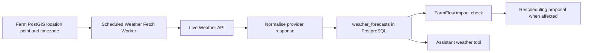

# FarmCore Weather Integration

Sources:

- [Project Brief](../client-notion/project-brief.md)
- [User Stories: US15, US22, US24, US27](../client-notion/user-stories.md)
- [POC Logical Schema](../client-notion/erd-whiteboard-tables.md)
- [FarmFlow Rescheduling](farmflow-rescheduling.md)

FarmCore POC uses live weather API data. Weather is fetched by backend infrastructure, normalised, stored, then supplied as structured input to FarmFlow and chat tools.

## Ownership Rule

```text
Backend WeatherProvider fetches live weather.
PostgreSQL stores normalised forecast snapshots.
FarmFlow reads structured forecast data.
AI assistant reads weather through controlled backend tool.
LLM does not call weather provider directly.
```

## Flow



## POC Data Contract

Target normalised POC data contract:

```text
farm_id
forecast_for_date
condition
rainfall_mm
precipitation_probability
max_temperature_c
wind_kph
wind_gust_kph
retrieved_at
source_name
```

The current SQL DDL requires a follow-up migration for the additional forecast
fields. Farm location comes from `farms.location_point` and `farms.timezone`.

## Fetch and Use Policy

1. Fetch forecast for next seven days for every active farm.
2. Run every six hours and after farm location changes. A controlled current-weather request may refresh the cache when practical.
3. Preserve snapshots using `retrieved_at` so schedule proposals can state which forecast they used.
4. FarmFlow uses latest forecast snapshot available when creating a proposal.
5. A meaningful forecast change triggers FarmFlow impact evaluation, not automatic replacement of approved schedule.
6. Assistant can answer weather questions from stored data and state retrieval time/source.
7. Forecast data older than twelve hours is marked stale in UI and assistant explanations; latest available data remains visible.

## Failure and Incomplete Data

```text
Weather provider unavailable
-> retain most recent forecast snapshot
-> mark weather information stale in UI/explanation
-> do not invent weather values
-> FarmFlow states weather constraint was not evaluated when no usable data exists
```

## POC Boundaries

Included:

```text
Live forecast retrieval
Seven-day forecast cache
Rainfall, wind, temperature, condition inputs
Weather-driven schedule proposal demonstration
```

Deferred:

```text
Historical weather analytics
Microclimate/sensor data
Severe-weather push notifications
Per-task agricultural weather models
```

## Open Details

1. Which live weather API provider will be used?
2. Which task types have weather constraints in POC?
3. What thresholds apply, for example wind for spraying or rainfall for field work?
